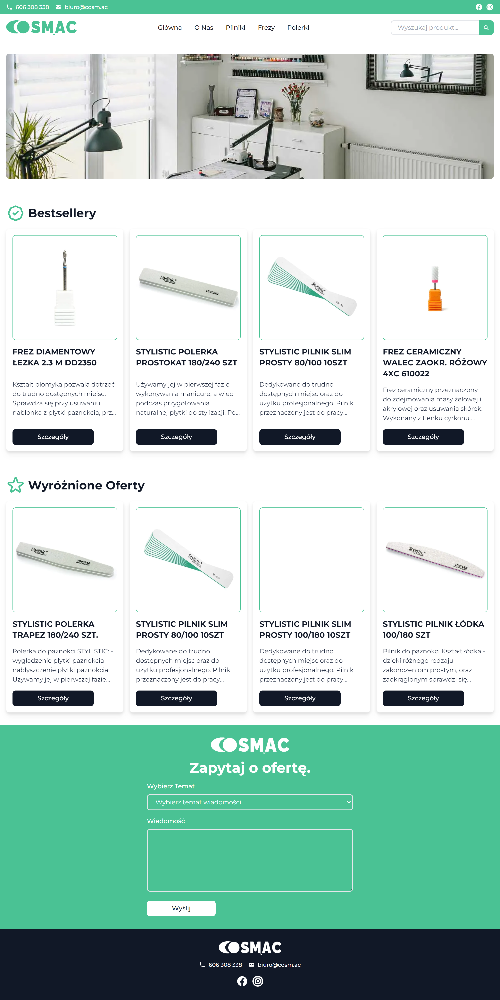

# Cosmac
> App created for nail salon with Django and Next.js.
> Live demo [_here_](https://cosmac.vercel.app).

## Technologies
**Frontend**
- React
- Next.js
- Typescript
- Tailwind CSS

**Backend**
- Django
- Django Rest Framework

## Setup
```
docker-compose up
```


## Features
- Modal showing product details
- Email sending form
- Products organized by categories
- Products searching bar

## Preview
**Desktop**

**Mobile**

